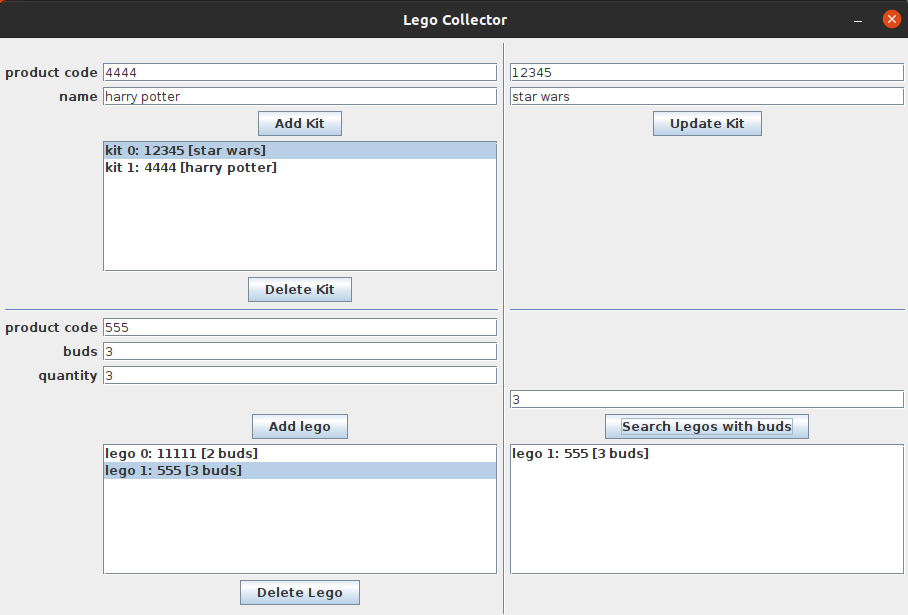

# lego-collector
A simple lego collector project for Advanced Programming Techniques Exam at Unifi.

###### Continuous integration (by [GitHub Actions](https://github.com/features/actions)):
[](https://github.com/AngeloDamante/lego-collector/actions/workflows/maven.yml)

###### Code coverage (by [Coveralls](https://coveralls.io/)):
[](https://coveralls.io/github/AngeloDamante/lego-collector?branch=main)

###### Code coverage (by [SonarCloud](https://www.sonarsource.com/products/sonarcloud/)):
[](https://sonarcloud.io/summary/new_code?id=AngeloDamante_lego-collector)

###### Code quality (by [SonarCloud](https://www.sonarsource.com/products/sonarcloud/)):
[](https://sonarcloud.io/summary/new_code?id=AngeloDamante_lego-collector)
[](https://sonarcloud.io/summary/new_code?id=AngeloDamante_lego-collector)
</br>
[](https://sonarcloud.io/summary/new_code?id=AngeloDamante_lego-collector)
[](https://sonarcloud.io/summary/new_code?id=AngeloDamante_lego-collector)
</br>
[](https://sonarcloud.io/summary/new_code?id=AngeloDamante_lego-collector)
[](https://sonarcloud.io/summary/new_code?id=AngeloDamante_lego-collector)
[](https://sonarcloud.io/summary/new_code?id=AngeloDamante_lego-collector)
</br>
[](https://sonarcloud.io/summary/new_code?id=AngeloDamante_lego-collector)
[](https://sonarcloud.io/summary/new_code?id=AngeloDamante_lego-collector)
[](https://sonarcloud.io/summary/new_code?id=AngeloDamante_lego-collector)

## Build and Run
To make `fatjar` from maven with assembly plugin
```bash
mvn -f lego-collector/pom.xml -Dtests.ut.skip=true -Dtests.it.e2e.skip=true package
```
Then, run docker container
```bash
docker run -p 27017:27017 --rm mongo:4.4.3
```
Finally, run the application
```bash
java -jar lego-collector-1.0-SNAPSHOT-jar-with-dependencies.jar
```
<p align=center>

| Argument | Description |
| -- | -- |
| --mongo-host | MongoDB server address |
| --mongo-port | MongoDB server port |
| --db-name | Name of the database to use |
| --collection-artists-name | Name of the collection of artist in the database |
| --collection-works-name | Name of the collection of works in the database |

</p>

## Tests
To run all unit test
```bash
mvn -f lego-collector/pom.xml -Dtests.it.e2e.skip=true clean verify
```
To run only IT and E2E tests:
```bash
mvn -f lego-collector/pom.xml -Dtests.ut.skip=true clean verify
```
To run all tests
```bash
mvn -f lego-collector/pom.xml clean verify
```

### Results
```bash
-------------------------------> UT
[INFO] Running com.angelodamante.model.repository.KitMongoRepositoryTest
INFO] Tests run: 8, Failures: 0, Errors: 0, Skipped: 0, Time elapsed: 0.807 s
[INFO] Running com.angelodamante.model.repository.LegoMongoRepositoryTest
[INFO] Tests run: 8, Failures: 0, Errors: 0, Skipped: 0, Time elapsed: 0.137 s
[INFO] Running com.angelodamante.controller.LegoControllerTest
[INFO] Tests run: 13, Failures: 0, Errors: 0, Skipped: 0, Time elapsed: 0.277 s
[INFO] Running com.angelodamante.view.LegoSwingViewTest
[INFO] Tests run: 31, Failures: 0, Errors: 0, Skipped: 0, Time elapsed: 19.491 s
[INFO] 
[INFO] Results:
[INFO] Tests run: 60, Failures: 0, Errors: 0, Skipped: 0

------------------------------> IT
[INFO] Running com.angelodamante.model.repository.KitMongoRepositoryTestcontainersIT
[INFO] Tests run: 4, Failures: 0, Errors: 0, Skipped: 0, Time elapsed: 3.356 s
[INFO] Running com.angelodamante.model.repository.LegoMongoRepositoryTestcontainersIT
[INFO] Tests run: 3, Failures: 0, Errors: 0, Skipped: 0, Time elapsed: 1.807 s
[INFO] Running com.angelodamante.view.LegoSwingViewIT
[INFO] Tests run: 11, Failures: 0, Errors: 0, Skipped: 0, Time elapsed: 11.514 s
[INFO] 
[INFO] Results:
[INFO] Tests run: 18, Failures: 0, Errors: 0, Skipped: 0

------------------------------> E2E
[INFO] Running com.angelodamante.app.LegoAppE2E
[INFO] Tests run: 11, Failures: 0, Errors: 0, Skipped: 0, Time elapsed: 18.887 s
[INFO] 
[INFO] Results:
[INFO] Tests run: 11, Failures: 0, Errors: 0, Skipped: 0
```

## Layout Directories
```
.
├── lego-collector
│   ├── pom.xml
│   └── src
│       ├── e2e
│       │   └── java/com/angelodamante
│       │       └── app
│       │           └── LegoAppE2E.java
│       ├── it
│       │   └── java/com/angelodamante
│       │       ├── model
│       │       │   └── repository
│       │       │       ├── KitMongoRepositoryTestcontainersIT.java
│       │       │       └── LegoMongoRepositoryTestcontainersIT.java
│       │       └── view
│       │           └── LegoSwingViewIT.java
│       ├── main
│       │   ├── java/com/angelodamante
│       │   │   ├── app
│       │   │   │   └── LegoApp.java
│       │   │   ├── controller
│       │   │   │   └── LegoController.java
│       │   │   ├── model
│       │   │   │   ├── entities
│       │   │   │   │   ├── Entity.java
│       │   │   │   │   ├── KitEntity.java
│       │   │   │   │   └── LegoEntity.java
│       │   │   │   └── repository
│       │   │   │       ├── KitMongoRepository.java
│       │   │   │       ├── KitRepository.java
│       │   │   │       ├── LegoMongoRepository.java
│       │   │   │       └── LegoRepository.java
│       │   │   └── view
│       │   │       ├── LegoSwingView.java
│       │   │       └── LegoView.java
│       │   └── resources
│       │       └── log4j2.xml
│       └── test
│           ├── java/com/angelodamante
│           │   ├── controller
│           │   │   └── LegoControllerTest.java
│           │   ├── model
│           │   │   └── repository
│           │   │       ├── KitMongoRepositoryTest.java
│           │   │       └── LegoMongoRepositoryTest.java
|           │   └── view
|           │       └── LegoSwingViewTest.java
│           └── resources
│               └── log4j2.xml
└── README.md
```

## Model View Controller Pattern
An mvc with repository pattern was implemented for this project for the DAL  (Data Access Layer).
<p align=center>
    
</p>


## Operations


### To Handle Kits
The functions of adding and deleting kits have been implemented. The id of each added kit is cumulative; it was chosen not to give the user the opportunity to enter two identical ids.

### To Handle Legos Brick
Buds, are the rounds above the bricks. Many bricks, have no buds, so 0 is allowed. Again, the id is cumulative and it is not the user's responsibility to enter it.

### To Update Kit
The user has been provided with the ability to change the stored kits. In fact, it is possible to change the product code and name. Clearly, this function is enabled only if a kit is selected.

### To Search Bricks
A very useful feature for a collector who perhaps needs to know whether or not they have a certain brick is to search for bricks according to their buds. Thus it is possible to know which bricks fit with the one desired.